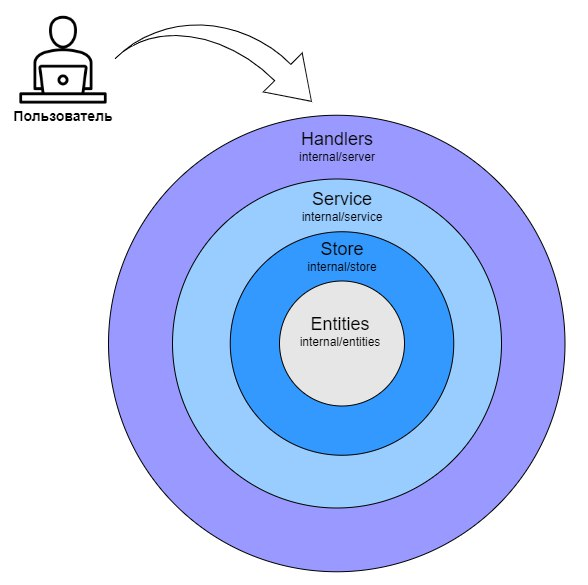
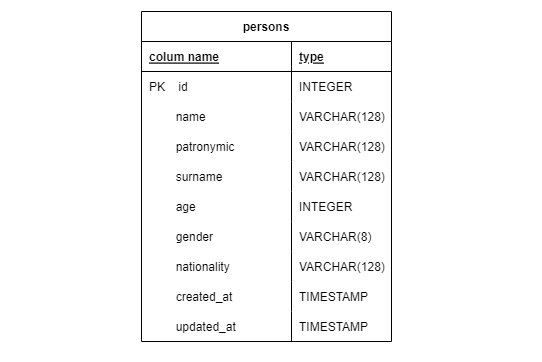

# effective-mobile-task
- [Условие задачи](#task)
- [Архитектура](#arch)
  - [Структура приложения](#arch-struct)
  - [Схема БД](#arch-db)
- [Использованные библиотеки](#libs)
- [Конфигурация приложения](#config)
- [Управление приложением](#management)
  - [Makefile](#management-makefile)
  - [Запуск приложения](#management-containers)
- [Тестовая демонстрация](#demo)
# Условие задачи <a name="task"/>
Реализовать сервис, который будет получать ФИО по API, затем будет обогащать ответ из открытых API наиболее вероятными возрастом, полом и национальностью и сохранять данные в
БД. По запросу выдавать информацию о найденных людях.  
  
Необходимо реализовать следующее:
1. Выставить rest методы:
    - Для получения данных с различными фильтрами и пагинацией
    - Для удаления по идентификатору
    - Для изменения сущности
    - Для добавления новых людей в формате:
      ```
      {
        "name": "Dmitriy",
        "surname": "Ushakov",
        "patronymic": "Vasilevich" // необязательно
      }
      ```
2. Корректное сообщение обогатить
    - Возрастом - https://api.agify.io/?name=Dmitriy
    - Полом - https://api.genderize.io/?name=Dmitriy
    - Национальностью - https://api.nationalize.io/?name=Dmitriy
3. Обогащенное сообщение положить в БД postgres (структура БД должна быть создана
путем миграций)
4. Покрыть код debug- и info-логами
5. Вынести конфигурационные данные в .env

# Архитектура <a name="arch"/>

## Структура приложения <a name="arch-struct"/>


## Схема БД <a name="arch-db"/>


Подробнее: [migrations/01_pg_eff_mobile.sql](migrations/01_pg_eff_mobile.sql)

# Использованные библиотеки <a name="libs"/>
- Логгирование: [go.uber.org/zap](https://github.com/uber-go/zap)
- Работа с БД: [jackc/pgx](https://github.com/jackc/pgx), [pressly/goose](https://github.com/pressly/goose)
- Работа с HTTP: [gin-gonic/gin](https://github.com/gin-gonic/gin), [go-resty/resty](https://github.com/go-resty/resty)
- Тестирование: [stretchr/testify](https://github.com/stretchr/testify), [go.uber.org/mock/gomock](https://github.com/uber-go/mock)

# Конфигурация приложения <a name="config"/>


Приложение конфигурируется с помощью переменных окружения и флагов командной строки.
Доступные параметры для конфигурации представлены в следующей таблице:

| Переменная окружения           | Флаг командной строки | Описание                                      |
|--------------------------------|-----------------------|-----------------------------------------------|
| `RUN_ADDR`                     | `-a <host:port>`      | адрес и порт запуска сервера                  |
| `LOG_LEVEL`                    | `-l <level>`          | уровень логирования                           |
| `DATABASE_DSN`                 | `-d <dsn>`            | адрес подключения к базе данных               |
  
  
> Способ конфигурации зависит от места и контекста работы приложения.  
Например, если приложение запускается в контейнере, то конфигурировать его [приложение] следует через переменные окружения среды [контейнера].  
А если выполняется разработка и/или отладка, то для конфигурации удобнее ипользовать флаги командной строки.  
# Управление приложением <a name="management">
## Makefile <a name="management-makefile">
Подготовка приложения, тестирование, и запуск выполняется с помощью команды make (из корня репозитория).  
В Makefile определены основные команды для управления приложением:  

- Информация о доступных командах Makefil-а:
  ```
  make info
  ```
- Запуск тестов приложения
  ```
  make test
  ```
- Создание и запуск контейнеров, необходимых для работы приложения (программа и база данных)  
  ```
  make docker-dev-up
  ```
- Остановка и удаление контейнеров, созданных командой выше (docker-dev-up)
  ```
  make docker-dev-down:
  ```
- Создание и запуск контейнера (тестовая база данных) для тестирования приложения  
  ```
  make docker-test-up
  ```
- Остановка и удаление контейнера, созданного предыдущей командой (docker-test-up)
  ```
  make docker-test-down:
  ```

  
Подробнее: [Makefile](Makefile)  
  
## Запуск приложения <a name="management-containers">    
Команда для создания и запуска контейнеров с приложением и базой данных:  
```
make docker-dev-up
```      
После успешного завершения команды можно взаимодействовать с API приложения.  
Конфигурация запущенных контейнеров: [docker-compose/dev/docker-compose.yml](docker-compose/dev/docker-compose.yml)

# Тестовая демонстрация <a name="demo">
После [запуска приложения](#management-containers) можно проверить работу сервиса в ручном режиме.  
  
Файл для тестовой демонстрации работы сервиса: [demonstration.http](demonstration.http)  
В файле представлены все возможные HTTP-запросы к приложению.  
> *Файл [demonstration.http](demonstration.http) предназначен для расширения* [*REST Client*](https://marketplace.visualstudio.com/items?itemName=humao.rest-client) *в редакторе Visual Studio Code*  
